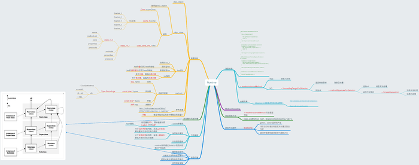
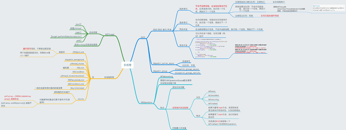
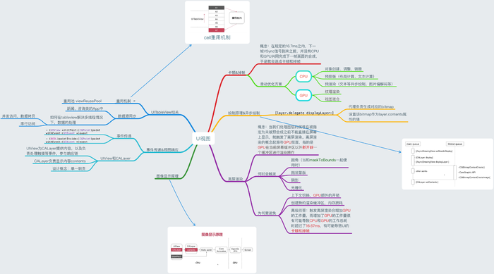
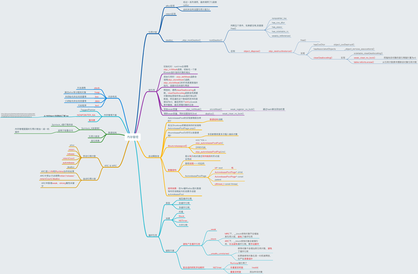
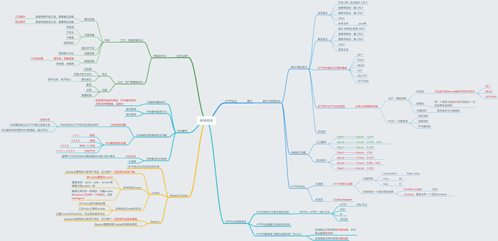

# iOSAdvanceSet

iOS 进阶知识点

1、[runtime](https://fcf5646448.github.io/2019/01/23/Runtime/)

2、[runloop](https://fcf5646448.github.io/2019/02/19/RunLoop/)

3、[多线程](https://fcf5646448.github.io/2018/04/19/multithreads/)

4、[UI渲染过程](https://fcf5646448.github.io/2017/11/19/UIViewAbout/)

5、[iOS内存管理](https://fcf5646448.github.io/2018/06/13/OC-Memory/)

6、[计算机网络](https://fcf5646448.github.io/2018/08/08/NetWork/)

[iOS思维导图](https://www.jianshu.com/p/a2c85b9f6a25)