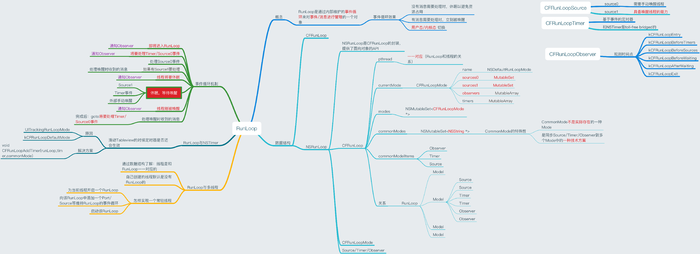

# iOSAdvanceSet

iOS 进阶知识点

1、[runtime](https://fcf5646448.github.io/2019/01/23/Runtime/)

2、[runloop](https://fcf5646448.github.io/2019/02/19/RunLoop/)

3、《GCD》

4、《UI渲染过程》

5、《通知》

6、《响应连》

8、《卡顿优化》

7、《模块化》

[iOS思维导图](https://www.jianshu.com/p/a2c85b9f6a25)