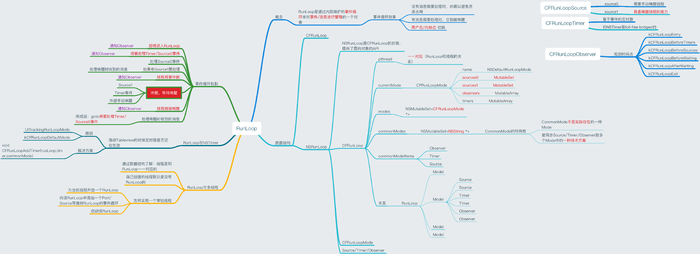
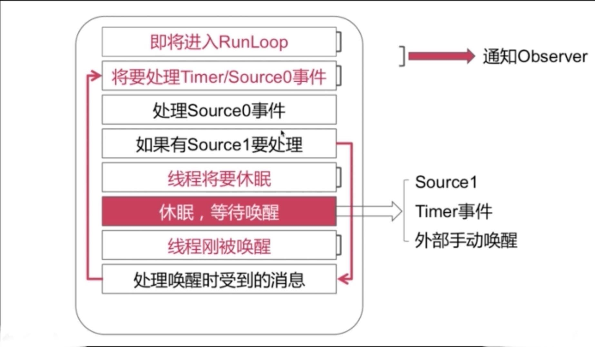

### 理论
#### 自我理解
首先，一个函数(包括main函数)在按顺序执行完逻辑代码后就会return，然后函数栈里的资源就会被回收掉。比如C语言的简单main函数，执行return后，程序就结束了。那一个APP，其实也是由main函数入口和结束的程序。如果main函数里什么都不做，跑完会立马回到桌面上。比如iOS
```Objective-C
int main(int argc, char * argv[]) {
    return 0; //执行完这里就会退回桌面
    @autoreleasepool {
        return UIApplicationMain(argc, argv, nil, NSStringFromClass([AppDelegate class]));
    }
}
```
那要怎样，我们才能保留App程序的活性呢！很简单，在main函数里添加一个死循环。
```Objective-C
int main(int argc, char * argv[]) {
    do {
        printf("xxx");
    } while (1);
    
    @autoreleasepool {
        return UIApplicationMain(argc, argv, nil, NSStringFromClass([AppDelegate class]));
    }
}
```
这时候你会发现App程序不会再退出来了，而是一直在消耗CPU和内存，直到iOS系统把它强制杀掉。而RunLoop实际上也是一个类似的运行循环，使iOS应用程序在main函数中保存运行状态，不会退出。


标准答案： **RunLoop是通过内部维护的“事件循环”来对“事件/消息进行管理”的一个对象**
关键点：
**事件循环（Event Loop）**：维护的事件循环可以用来不断地处理事件或消息，然后进行管理 ！同时当没有消息需要处理时，会从用户态向内核态进行切换，由此可以进行当前线程的休眠，以避免资源占用；另外当有消息需要处理时，会发生从内核态到用户态的切换，然后当前用户线程就会立即被唤醒。(所以不是上面假设的while循环那么简单)。   有消息需要处理时是**用户态**，没有时是**内核态**。
用户态：系统上层应用程序活动的空间。
内核态：内核资源，为上层应用提供资源。

Q：什么是RunLoop？
**RunLoop是内部维护事件循环的一个对象。而事件循环可以不断地对消息或事件进行管理：当没有消息时，会将进程从用户态切到内核态，由此对当前线程进行休眠，以避免资源占用；当有消息需要处理时，会从内核态切到用户态，以便及时唤醒线程。**

Q：main函数为什么可以保持不退出？
**main函数调用的ApplicationMain里启动了主线程的RunLoop运行循环。而RunLoop可以不断地接受和处理消息，同时在用户态和内核态之间进行切换，从而避免资源的占用及休息。所以Main函数不会退出**


#### RunLoop的作用：

* 保证程序不退出；
* 监听事件：网络事件、定时器事件、触摸事件；
* 定时渲染UI：每个Runloop期间，被标记为需要重绘的UI都会进行重绘；
* 调节CPU的工作，休息或工作。Runloop各个状态的调整；


#### RunLoop的数据结构
NSRunLoop是对CFRunLoop的封装。
* CFRunLoop：内部的数据结构包含了 pthread、modes、currentMode、commonModes、CommonModeItems。 由此可以发现线程和runloop是一个一一对应的关系；modes是一个mode的集合。CommonModeItems包含多个Observer、多个Timer、多个Source。
* CFRunLoopMode：数据结构包含了name、sources0、sources1、observers、timers。
* CFRunLoopSource：source0、source1；source0需要手动唤醒线程，source1具备唤醒线程的能力。
* CFRunLoopTimer：基于事件的定时器，具备和NSTimer免费转换
* CFRunLoopObserver：可以通过注册一些observer对runloop进行一些相关时间点的监测和观察。主要监测的时间点有6个：
  **KCFRunLoopEntry** （通知观察者runloop准备启动了）；
  **kCFRunLoopBeforeTimers**（通知观察者runloop将要对一些timer的相关事件进行处理）；
  **kCFRunLoopBeforeSources** (通知观察者runloop将要处理一些source时间)
  **kCFRunLoopBeforeWaiting** (通知观察者runloop即将进入休眠状态，用户态到内核态的切换)
  **kCFRunLoopAfterWaiting** (通知观察者runloop即将从内核态切换为用户态)
  **KCFRunLoopExit** (通知观察者runloop即将退出)

**一个RunLoop对应若干个Mode，每个Mode对应若干个Observer、Timer、Source。** 不同mode里的事件不会相互影响。也就是说当我们把一个timer、observer、source添加到某一个mode上后，如果当前runloop是运行在另一个runloop下面的话，对应的timer、source、observer事件是不会进行响应的。

#### Runloop mode
* kCFRunLoopDefaultMode: App的默认Mode，通常主线程在这个mode下运行；

* UITrackingRunLoopMode: 界面跟踪Mode，用于ScrollView追踪触摸滑动，保证界面滑动时不受其他Mode影响；

* UIInitializationRunLoopMode: 刚启动App时的Mode，启动完成就不再使用；

* GSEventReceiveRunLoopMode: 接受系统事件的内部mode，通常用不到；

* KCFRunLoopCommonModes: 并不是一个实际存在的mode，其实是同步source、timer、observer到多个mode中的一种技术方案。


#### RunLoop事件循环机制


大概说一下，在runloop开启的时候会发出kCFRunLoopEntry通知，告知即将进去RunLoop。那一启动就相当于进入了用户态的模式，所以优先处理Timer事件，如果有标记过的source0事件那就接着处理source0事件，如果有source1事件（也就是唤醒时收到的消息）那就处理source1事件，如果没有source1事件，那就会发出beforWaiting通知进入休眠状态。在休眠期间如果收到了Timer、source1、外部手动唤醒等事件，则runloop又会被唤醒。

* 面试题：从点击APP图标到程序启动、运行、退出。这个过程中系统都发生了什么？

    我们调用了main函数之后，会调用UIApplicationMain这个函数。在这个函数内部会启动主线程的runloop，在经过一系列处理后（timer、source0事件），runloop就会进入休眠状态。而此时如果我们点击屏幕，会产生一个mach_port，基于mach_port会转成source1事件，然后将主线程唤醒。最后杀死程序的时候就会发出KCFRunLoopExit的通知。

### 实战
#### RunLoop 与 NSTimer
##### scrollview滑动时，NSTimer不生效问题
解题思路：正常情况下，scrollview在当前线程(UI主线程)是运行在DefaultMode下的，当发送滑动时，会发生mode的切换，会切换到UITrackingRunLoopMode下。前面讲述到，当我们把一个timer、observer、source添加到某一个mode上后，如果当前runloop是运行在另一个runloop下面的话，对应的timer、source、observer事件是不会进行响应的。而这里，Timer默认添加到DefaultMode下的，所以当切换到TrackingMode之后，Timer就不会再生效了。所以这时commonmodes就起作用了，因为commonmodes可以把timer的事件同步到多个mode中。

```Objective-C
#pragma mark -- RunLoop 与 NSTimer
- (void)begintime {
    _tick = 0;
    NSTimer * timer = [NSTimer timerWithTimeInterval:0.5 target:self selector:@selector(timeTick) userInfo:nil repeats:YES];
    [[NSRunLoop currentRunLoop] addTimer:timer forMode:NSRunLoopCommonModes]; //如果这里是NSDefaultRunLoopMode，则滚动textview的时候，定时器不会走
}

- (void)timeTick {
    _tick += 1;
    _timelabel.text = [NSString stringWithFormat:@"%ld",_tick];
}

```
#### RunLoop 与 多线程
##### 如何实现一个常驻线程
解题思路：前文数据结构中可知线程和RunLoop是一一对应的关系；自己创建的线程默认情况下是没有RunLoop的。所以首先我们要为线程开启一个RunLoop，其次向RunLoop中添加一个Port/Source等维持RunLoop的事件循环，最后启动。常驻线程就避免了系统频繁地创建和销毁线程。比如网络请求时，一般需要开辟子线程进行请求，但是不能每个接口都去开辟新的线程，所以开一个常驻线程是最好的处理方式。

```Objective-C
#pragma mark -- RunLoop 实现常驻线程
static BOOL runAlways = YES;
- (void)usethread {
    [self performSelector:@selector(subThreadRun) onThread:self.thread withObject:nil waitUntilDone:NO];
}

//线程安全的方式创建thread
- (NSThread *)thread {
    if (_thread == nil) {
        @synchronized (self) {
            _thread = [[NSThread alloc] initWithTarget:self selector:@selector(runThread) object:nil];
            [_thread setName:@"com.fcf.thread"];
            [_thread start];// 启动
        }
    }
    return _thread;
}

- (void)runThread {
    //方法一：创建一个可控的runloop
    //创建一个source
    CFRunLoopSourceContext context = {0,NULL,NULL,NULL,NULL,NULL,NULL,NULL,NULL,NULL};
    CFRunLoopSourceRef source = CFRunLoopSourceCreate(kCFAllocatorDefault, 0, &context);

    //创建runloop，同时向runloop的defaultmode添加source CFRunLoopGetCurrent类似懒加载方法
    CFRunLoopAddSource(CFRunLoopGetCurrent(), source, kCFRunLoopDefaultMode);

    while (runAlways) {
        @autoreleasepool {
            //将当前runloop运行在kCFRunLoopDefaultMode下
            CFRunLoopRunInMode(kCFRunLoopDefaultMode, 1.0e10, true);
        }
    }

    //当runaway为NO时跳出runloop，线程退出
    CFRunLoopRemoveSource(CFRunLoopGetCurrent(), source, kCFRunLoopDefaultMode);
    CFRelease(source);
    
    //方法二：创建一个一直存在的runloop
//    @autoreleasepool {
//        NSRunLoop * runloop = [NSRunLoop currentRunLoop];
//        [runloop addPort:[NSMachPort port] forMode:NSRunLoopCommonModes];
//        NSLog(@"启动RunLoop前--%@",runloop.currentMode);
//        [runloop run];
//    }
    
}

- (void) subThreadRun {
    NSLog(@"启动RunLoop后--%@",[NSRunLoop currentRunLoop].currentMode);
    NSLog(@"%@----子线程任务开始",[NSThread currentThread]);
    [NSThread sleepForTimeInterval:3.0];
    NSLog(@"%@----子线程任务结束",[NSThread currentThread]);
}
```
[避免使用 GCD Global队列创建Runloop常驻线程](https://www.jianshu.com/p/7eaedfc8f8f6)

#### RunLoop 与 UITableView
通过runloop对UItableview的卡顿进行优化。上文有提到runloop除了保证程序不退出外，它还可以监听消息、定时渲染UI。所以在UITableView滑动时，会触发屏幕UI变化，UI变化会触发Cell的复用和渲染，而如果Cell的渲染耗时太长就会造成在runloop一次迭代之内，CPU和GPU的渲染工作无法完成造成失帧，形成卡顿。

所以解决的机制就是：1、将耗时的任务从主线程剥离，放到runloop进入beforWaiting的休眠状态之后再执行。

```Objective-C
typedef void(^RunLoopTask)(void);

@interface TestTableController ()
@property (nonatomic, strong)NSMutableArray * dataSource;
//用来存放任务的数组
@property (nonatomic, strong) NSMutableArray<RunLoopTask> *tasks;
//最大任务数量
@property (nonatomic, assign) NSInteger maxTaskCount;


@end

@implementation TestTableController

- (void)viewDidLoad {
    [super viewDidLoad];
    self.title = @"优化TB";
    _dataSource = [NSMutableArray array];
    _tasks = [NSMutableArray array];
    _maxTaskCount = 27; //一般是初始化cell的个数。
    _useRunloop = YES;
    
    self.tableView.rowHeight = 80;
    self.tableView.tableFooterView = [UIView new];
    
    //添加定时器，使每个时间间隔定时唤醒runloop。
    CADisplayLink * displaylink = [CADisplayLink displayLinkWithTarget:self selector:@selector(timeMethod)];
    [displaylink addToRunLoop:[NSRunLoop currentRunLoop] forMode:NSRunLoopCommonModes];
    
    
    [self addRunLoopObserver];
    [self createDate];
}

- (void)timeMethod {
    //什么都不做
}

- (void)createDate {
    
    [self.tableView reloadData];
}
//监听runloop，利用runloop休眠的时机执行耗时task
- (void)addRunLoopObserver {
    /* CFRunLoopAddObserver 注册runloop观察者函数，三个参数分别是currentrunloop、observer、mode
     * CFRunLoopObserverCreateWithHandler 创建观察者函数，kCFRunLoopBeforeWaiting,表示监听runloop即将切到内核态的通知，也可以监听所有通知kCFRunLoopAllActivities。
     *
     */
    
    
    //获取当前的runloop
    CFRunLoopRef runloop = CFRunLoopGetCurrent();
    //定义一个context
    CFRunLoopObserverContext context = {
        0,
        (__bridge void *)(self),
        &CFRetain,
        &CFRelease,
        NULL
    };
    //定义一个观察者
    static CFRunLoopObserverRef defaultModeObserver;
    //创建观察者
    defaultModeObserver = CFRunLoopObserverCreate(kCFAllocatorDefault,
                                                  kCFRunLoopBeforeWaiting,
                                                  YES,
                                                  0,
                                                  &CallBack,
                                                  &context);
    //添加观察者
    CFRunLoopAddObserver(runloop, defaultModeObserver, kCFRunLoopDefaultMode);
    //
    CFRelease(defaultModeObserver);
    
//    //每16.7ms会执行一次
//    __weak typeof(self) weakself = self;
//    CFRunLoopAddObserver(CFRunLoopGetCurrent(), CFRunLoopObserverCreateWithHandler(nil, kCFRunLoopBeforeWaiting, YES, 0, ^(CFRunLoopObserverRef observer, CFRunLoopActivity activity) {
//        //
//        if (weakself.tasks.count == 0) {
//            return ;
//        }
//        // 这样每一次都会把所有task都执行一遍
//        while (weakself.tasks.count > 0) {
//            RunLoopTask task = [weakself.tasks objectAtIndex:0];
//            //执行
//            task();
//            //执行完移除
//            [self.tasks removeObjectAtIndex:0];
//        }
//    }), kCFRunLoopDefaultMode);
    
}

// 任务单独选择时机执行
static void CallBack(CFRunLoopObserverRef bserver, CFRunLoopActivity activity,void * info) {
    TestTableController * vcself = (__bridge TestTableController *)info;
    if (vcself.tasks.count == 0) {
        return;
    }
    RunLoopTask task = vcself.tasks.firstObject;
    if (task) {
        task();
    }
    [vcself.tasks removeObjectAtIndex:0];
}

//添加任务到数组
- (void)addTask:(RunLoopTask)task{
    //保存新任务
    [self.tasks addObject:task];
    
    //保证之前没来得及显示的图片不会再绘制
    if (self.tasks.count > _maxTaskCount) {
        [self.tasks removeObjectAtIndex:0];
    }
}

#pragma mark - Table view data source

- (NSInteger)numberOfSectionsInTab啧啧啧啧啧啧做做做做做做做leView:(UITableView *)tableView {
    return 1;
}

- (NSInteger)tableView:(UITableView *)tableView numberOfRowsInSection:(NSInteger)section {
    return 300;
}

- (UITableViewCell *)tableView:(UITableView *)tableView cellForRowAtIndexPath:(NSIndexPath *)indexPath {
    return [self loadCellWithRunLoop:tableView atIndexPath:indexPath];
}


- (UITableViewCell *)loadCellWithRunLoop:(UITableView *)tableView atIndexPath:(NSIndexPath *)indexPath {
    ImgsCell *cell = [ImgsCell cellWithTableView:tableView];
    cell.img1.image = nil;
    cell.img2.image = nil;
    cell.img3.image = nil;
    __weak typeof(self) weakself = self;
    [self addTask:^{
        NSString *path = [[NSBundle mainBundle] pathForResource:@"01" ofType:@"jpg"];
        UIImage *img = [UIImage imageWithContentsOfFile:path];
        cell.img1.image = img;
    }];
    [self addTask:^{
        NSString *path = [[NSBundle mainBundle] pathForResource:@"02" ofType:@"jpg"];
        UIImage *img = [UIImage imageWithContentsOfFile:path];
        cell.img2.image = img;
    }];
    [self addTask:^{
        NSString *path = [[NSBundle mainBundle] pathForResource:@"03" ofType:@"jpg"];
        UIImage *img = [UIImage imageWithContentsOfFile:path];
        cell.img3.image = img;
    }];
    
    return cell;
}


@end
```
问题：虽然网上大部分教程的runloop优化tableview的操作都与此类似。但是还存在几个问题：
1、首屏渲染的问题。如果进到demo不进行拖动的话，首屏是不会自动渲染的。所以我就把添加最新任务的代码改成了下面这样。但是这样也会导致新的问题，因为tasks存储的不是最新的任务，所以当滑动停止时，屏幕上需要渲染的任务和tasks里的任务可能不是一一对应的，这就导致了有的img没有被渲染出来的问题。
```Objective-C
//添加任务到数组
- (void)addTask:(RunLoopTask)task{
    //保存新任务
    if (self.tasks.count < _maxTaskCount) {
        [self.tasks addObject:task];
    }
//    [self.tasks addObject:task];
//
//    //保证之前没来得及显示的图片不会再绘制
//    if (self.tasks.count > _maxTaskCount) {
//        [self.tasks removeObjectAtIndex:0];
//    }
}
```
2、如果将观察者里的kCFRunLoopDefaultMode改成NSRunLoopCommonModes（目的是为了一边滑动也可以一边渲染）,当资源img不止是当前那3张图片时，页面会出现明显的卡顿现象！
(如果有哪位大神解决了上述问题，还请告知)

#### RunLoop 监测主线程的卡顿，并将卡顿时的线程堆栈信息保存下来
根据上面RunLoop事件循环的img，我们可以看到，主线程在kCFRunLoopBeforeSources和kCFRunLoopBeforeWaiting之间耗时的时长是检测主线程是否卡顿的一个方式。如果这个耗时大于某个阈值，则会存在卡顿。所以检测卡顿就可以在这两个状态下监听耗时，如果存在卡顿则把线程堆栈记录下来。

```Objective-C
#import "CheckBlockManager.h"
#import <CrashReporter/CrashReporter.h> //打印crash的第三方framework


/* 往主线程runloop添加observer，以监听主线程的runloop周期变化
 * 往子线程添加定时器，以每隔一段时间检测耗时时长
 */

@interface CheckBlockManager()
@property (nonatomic, strong) NSThread                  *monitorThread; //监控线程
@property (nonatomic, assign) CFRunLoopObserverRef      observer;//观察者
@property (nonatomic, assign) CFRunLoopTimerRef         timer; //定时器

@property (nonatomic, strong) NSDate                    *startDate; //开始执行时间
@property (nonatomic, assign) BOOL                      excuting; //执行时长

@property (nonatomic, assign) NSTimeInterval            interval; //定时器间隔时长
@property (nonatomic, assign) NSTimeInterval            fault;    //卡顿阈值

@end

@implementation CheckBlockManager

static CheckBlockManager * _instance = nil;
+(instancetype)shareInstance {
    static dispatch_once_t onceToken;
    dispatch_once(&onceToken, ^{
        _instance = [CheckBlockManager new];
        _instance.monitorThread = [[NSThread alloc] initWithTarget:self selector:@selector(monitorThreadEntryPoint) object:nil];
        
        [_instance.monitorThread start];
    });
    return _instance;
}

+ (void)monitorThreadEntryPoint {
    //开启常驻线程
    @autoreleasepool {
        [[NSThread currentThread] setName:@"CheckBlockManager"];
        NSRunLoop * runloop = [NSRunLoop currentRunLoop];
        [runloop addPort:[NSMachPort port] forMode:NSDefaultRunLoopMode];
        [runloop run];
    }
}

// 开始监控
- (void)start {
    [self startWithInterval:1.0 fault:2.0];
}

// 往主线程runloop添加observer，以监听主线程的runloop周期变化
//开始监听 interval：定时器间隔时长  fault：卡顿阈值
- (void)startWithInterval:(NSTimeInterval)interval fault:(NSTimeInterval)fault {
    _interval = interval;
    _fault = fault;
    
    if (_observer) {
        return;
    }
    
    CFRunLoopObserverContext context = {
        0,
        (__bridge void *)(self),
        NULL,
        NULL,
        NULL
    };
    
    _observer = CFRunLoopObserverCreate(kCFAllocatorDefault,
                                        kCFRunLoopAllActivities,
                                        YES,
                                        0,
                                        &runloopCallBack,
                                        &context);
    
    //将obverse添加到主线程的runloop中
    CFRunLoopAddObserver(CFRunLoopGetMain(), _observer, kCFRunLoopCommonModes);
    
    //创建timer，并添加到子线程的runloop中
    [self performSelector:@selector(addTimerToMonitorThread) onThread:self.monitorThread withObject:nil waitUntilDone:NO modes:@[NSRunLoopCommonModes]];
    
    
}

// 往子线程添加定时器，以每隔一段时间检测耗时时长
- (void)addTimerToMonitorThread {
    if (_timer) {
        return;
    }
    //创建timer
    CFRunLoopRef currentRunLoop = CFRunLoopGetCurrent();
    CFRunLoopTimerContext context = {0,(__bridge void*)self,NULL,NULL,NULL};
    _timer = CFRunLoopTimerCreate(kCFAllocatorDefault,
                                  0.1,
                                  _interval,
                                  0,
                                  0,
                                  &runloopTimerCallBack,
                                  &context);
    CFRunLoopAddTimer(currentRunLoop, _timer, kCFRunLoopCommonModes);
    
}

- (void)removeTimer {
    if (_timer) {
        CFRunLoopRef currentRunLoop = CFRunLoopGetCurrent();
        CFRunLoopRemoveTimer(currentRunLoop, _timer, kCFRunLoopCommonModes);
        CFRelease(_timer);
        _timer = NULL;
    }
}

- (void)stop {
    if (_observer) {
        CFRunLoopRemoveObserver(CFRunLoopGetMain(), _observer, kCFRunLoopCommonModes);
        CFRelease(_observer);
        _observer = NULL;
    }
    [self performSelector:@selector(removeTimer) onThread:self.monitorThread withObject:nil waitUntilDone:NO modes:@[NSRunLoopCommonModes]];
}

//调用第三方打印卡顿信息
- (void)handleStackInfo {
    //打印
    NSData * lagData = [[[PLCrashReporter alloc] initWithConfiguration:[[PLCrashReporterConfig alloc] initWithSignalHandlerType:PLCrashReporterSignalHandlerTypeBSD symbolicationStrategy:PLCrashReporterSymbolicationStrategyAll]] generateLiveReport];
    PLCrashReport *lagReport = [[PLCrashReport alloc] initWithData:lagData error:NULL];
    NSString * lagReportString = [PLCrashReportTextFormatter stringValueForCrashReport:lagReport withTextFormat:PLCrashReportTextFormatiOS];
    
    //
    NSLog(@"%@",lagReportString);
}
//监听runloop
static void runloopCallBack(CFRunLoopObserverRef observer, CFRunLoopActivity activity, void *info) {
    CheckBlockManager * monitor = (__bridge CheckBlockManager*)info;
    NSLog(@"mainrunloop --- %@",[NSThread currentThread]);
    switch (activity) {
        case kCFRunLoopEntry:
            NSLog(@"kCFRunLoopEntry");
            break;
        case kCFRunLoopBeforeTimers:
            NSLog(@"kCFRunLoopBeforeTimers");
            break;
        case kCFRunLoopBeforeSources:
            NSLog(@"kCFRunLoopBeforeSources");
            monitor.startDate = [NSDate date];
            monitor.excuting = YES;
            break;
        case kCFRunLoopBeforeWaiting:
            NSLog(@"kCFRunLoopBeforeWaiting");
            monitor.excuting = NO;
            break;
        case kCFRunLoopAfterWaiting:
            NSLog(@"kCFRunLoopAfterWaiting");
            break;
        case kCFRunLoopExit:
            NSLog(@"kCFRunLoopExit");
            break;
        default:
            break;
    }
}

//监听timer
static void runloopTimerCallBack(CFRunLoopTimerRef timer, void *info) {
    CheckBlockManager * monitor = (__bridge CheckBlockManager*)info;
    if (!monitor.excuting) {
        return;
    }
    
    //如果主线程正在执行任务，并且这一次loop执行到现在还没执行完，那就需要计算时间差
    NSTimeInterval excuteTime = [[NSDate date] timeIntervalSinceDate:monitor.startDate];
    NSLog(@"定时器 -- %@",[NSThread currentThread]);
    NSLog(@"主线程执行了-- %f s",excuteTime);
    if (excuteTime >= monitor.fault) {
        NSLog(@"线程卡顿了%f秒",excuteTime);
        [monitor handleStackInfo];
    }
}


@end
```

#### RunLoop 让应用“起死回生”
应用起死回生就不再赘述了，因为结果也只是防止第一次崩溃而已。有兴趣可以去看这个大神的文章
[让应用起死回生](https://blog.csdn.net/u011619283/article/details/53673255)

