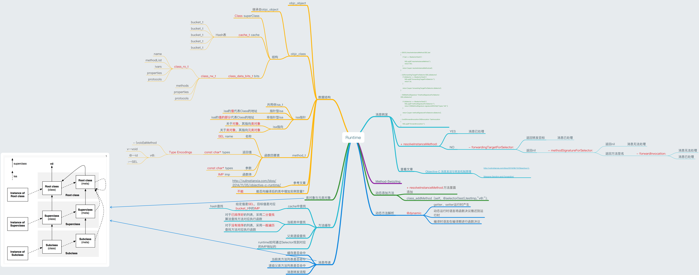
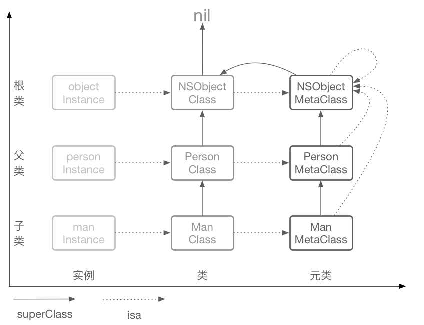

#### OC与Runtime
OC是一个面向对象的语言，面向对象是指**把一定的算法函数和数据变量以某种内在联系绑定在一起，形成最基本的结构单元**，这些结构单元即是抽象的对象，对其进行赋值等操作，则就会成为实体对象，即实例。通过使用继承、派生等手法可以让对象与对象之间产生各种微妙的联系。

OC是一门动态语言，有三个表现特征：动态类型、动态绑定、动态加载。

OC对消息的**处理需要先确定实际执行的方法然后在跳转过去执行**，而在编译期间是无法确定实际执行的目标函数，只有在运行期间才能得到最终确定。OC派发消息的过程是通过向目标target对象发送一个选择子Selector，而消息本身实际上只是一个字符串，比如向一个Person对象，发送一个eat的消息，实际上只是发送了一个字符串为“eat”的Selector，即使Person没有实现eat方法，编译仍然可以通过，但是运行期间会因找不到而抛出异常。

另外，OC的内存管理原则是**引用计数**机制。一个对象的创建始终是需要占用内存的，所以在不需要使用的时候就应该释放掉。引用时计数会加1，不在被需要时，引用计数减1，当引用计数为0时，则会被释放内存。

在OC中，一切皆为对象，**类本身也可以看做是“类”对象**。类所属的类成为元类。

综上所述，OC的面向对象、消息派发、动态绑定、内存管理等机制，都是与Runtime运行时环境息息相关的。

runtime是纯C语言的一个基础库

OC不能直接转成汇编语言，而是要先转成C语言，然后再进行编译和汇编的操作转成机器语言，机器语言是计算机唯一识别的语言。而从OC到C的过渡就是runtime来实现的。

runtime component—运行期组件，是指给OC在运行期间提供支持的运行环境。


#### 类与对象

OC的面向对象实现基本是由Runtime支撑的，那runtime是如何来定义OC的面向对象数据模型的？

首先，我们知道，OC绝大多数类都是继承自NSObject，NSProxy例外。那先来看一下NSObject及在RunTime源码里的数据结构的定义：
```Objective-C
//精简版
struct objc_class{
    Class _Nonnull isa OBJC_ISA_AVAILABILITY;

#if !__OBJC2__
	Class _Nullable super_class;
	const char* _Nonnull name;
	long version;
	long info;
	long instance_size;
	struct objc_ivar_list * _Nullable ivars;
	struct objc_method_list * _Nullable * _Nullable methodLists;
	struct objc_cache * _Nonnull cache;
	struct objc_protocol_list * _Nullable protocols;
#endif
}

struct objc_object {
    Class _Nonnull isa;
}

typedef struct objc_class *Class;

typedef struct objc_object *id;

@interface NSObjct <NSObjct> {
    Class isa;
}
```
这里我们可以看到，类Class是一个objc_class结构体指针，对象id是一个objc_object结构体指针。



上文中提到，OC中一切皆为对象，包括实例对象和类对象。Class表示类，object表示类的实例。

**isa**：指针的作用是指向自己所属的类。具体来说：实例的isa指针指向自己所属的类class，class的isa指针指向元类meta class。元类meta class的isa指针指向根元类，根元类isa指针指向它自己。

**super_class**： 指针指向了父类的类对象，元类的super_class指针指向了父类的元类，根元类的super_class指针指向了根类(NSObject)，NSObject的super_class指针为nil。这就说明类和元类虽然有各自的继承体系，但它们共同的根父类是NSObject。

因此，OC中类方法和实例方法都能存储在method list里了，是不是很合理？

另外，大概说一下objc_class里的其他成员属性：
**name**：类名；可以通过objc_getClass()来获取这个类的名字。
**version**：版本信息；
**info**：表示运行期的标识位，比如如果值为CLS_CLASS表示该类是普通class，如果值为CLS_META表示该类为metaclass。
**instance_size**：实例变量的大小，包括从父类继承下来的变量；
**ivars**：是objc_ivar_list的指针，它存储对象中每个实例变量的地址；
**methodLists**：存储方法的列表。不过会根据info做区分，如果info是普通class，则list存储的是实例方法，如果info是metaclass，则存储的是类方法;
**cache**：用来存储最近使用的方法，以提高效率；
**protocols**：用来存储遵守的协议；


#### 方法与成员

runtime也定义了方法 **method_t  * Method**、属性**property_t * objc_property_t**、变量**ivar_t * Ivar**;

##### Method:
```Objective-C
typedef sruct method_t *Method;
struct method_t {
   SEL name;
   const char * types;
   IMP imp;
};
```
这里先逐个解释一下方法结构体里的各个成员的含义：
**SEL**：选择子，它是一个object_selector指针，实际上只是一个C语言字符串；在类加载的过程中，编译器会生成与方法对应的选择子，并注册到runtime运行时系统；
**types**：存储着参数类型和返回值类型；
**imp**：函数指针：
```Objective-C
typedef void (*IMP)(void /*id,SEL,...*/);
```
对比一下C函数指针声明，是不是就能认为IMP就是函数指针：
```Objective-C
void (*funP)(int) ;//声明一个指向同样参数、返回值的函数指针变量
```
解析一下IMP里的各个参数
第一个参数是id，SEL是选择子，...是参数，void返回值类型；由此可见IMP是函数的实现，函数入口，即函数指针；
由此，我们可以总结一下**Method**、**SEL**、**imp**这三者的关系：**一个类(Class/MetaClass)持有一个函数链表，在运行期分发消息。表中的每个元素是一个方法Method，它的名字叫做选择子SEL对应着方法实现IMP**。
因为IMP是最具体的函数实现，所以在逆向的学习中使用IMP的机会也很多，而runtime也提供了很多IMP的C接口:
```Objective-C
//根据SEL获取IMP
- (IMP)methodForSelector:(SEL)aSelector; //实例方法指针
+ (IMP)instanceMethodForSelector:(SEL)aSelector; //类方法指针

//测试：
@interface TestObj : NSObject
- (void)testMethod;
- (void)testMethod:(NSString *)text;
@end

@implementation TestObj
- (void)testMethod {
    NSLog(@"IMP TEST");
}
- (void)testMethod:(NSString *)text {
    NSLog(@"IMP TEST %@",text);
}
@end

//实现消息调用优化
    TestObj * obj = [[TestObj alloc] init];
    void (*func)(id, SEL) = (void(*)(id, SEL))class_getMethodImplementation([TestObj class],@selector(testMethod));
    func(obj, @selector(testMethod));
    
    //
    IMP func1 = [[TestObj class] instanceMethodForSelector:@selector(testMethod)];
    func1();
    
    //
    IMP func2 = [obj methodForSelector:@selector(testMethod)];
    func2();

//结果：
2018-12-15 15:16:28.032083+0800 RuntimeDemos[4874:93761] IMP TEST
2018-12-15 15:16:29.039707+0800 RuntimeDemos[4874:93761] IMP TEST
2018-12-15 15:16:29.929389+0800 RuntimeDemos[4874:93761] IMP TEST
```

获取到函数指针后，就可以使用runtime的一些方法串改原本的函数实现：
```Objective-C
//使用block拦截函数具体实现：
IMP function = imp_implementationWithBlock(^(id self,NSString * text){
    NSLog(@"callback %@",text);
});
const char * types = sel_getName(@selector(testMethod:));
class_replaceMethod([TestObj class],@selector(testMethod:),function,types);

[obj testMethod:@"imp"];

//结果：
2018-12-15 16:31:21.780903+0800 RuntimeDemos[7978:157178] callback block: imp
```

##### Property
```Objective-C
typedef struct property_t * objec_property_t;
struct property_t {
    const char * name;
    const char * attributes;
}
```

##### Ivar
变量,ivar是指单纯的成员变量，不包括getter和setter方法：
当子类创建对象时，ivarlist里会包含所有父类的成员变量。

runtime 提供了一系列接口以获取对象的属性列表、方法列表、变量列表、协议列表。其中**属性property = ivar变量 + setter + getter**:
```Objective-C
//获取实例对象属性列表和协议属性列表
    unsigned int count = 0;
    // 获取属性列表
    objc_property_t * propertylists = class_copyPropertyList([TestObj class],&count);
    for (int i =0; i<count; i++) {
        const char * pname = property_getName(propertylists[i]);
        NSLog(@"property name:%s",pname);
    }
/* 输出：
property name:text
property name:num
property name:hash
property name:superclass
property name:description
property name:debugDescription
property name:protocol    
*/
    
    // 获取方法列表
    Method * methodList = class_copyMethodList([TestObj class], &count);
    for (int i =0; i<count; i++) {
        NSString * mname = NSStringFromSelector(method_getName(methodList[i]));
        NSLog(@"method name:%@",mname);
    }
/* 输出：
method name:testMethod
method name:testMethod:
method name:num
method name:setNum:
method name:setProtocol:
method name:.cxx_destruct
method name:protocol
method name:text
method name:setText:
*/

    // 获取变量列表
    Ivar * ivarList = class_copyIvarList([TestObj class], &count);
    for (int i=0; i<count; i++) {
        const char * iname = ivar_getName(ivarList[i]);
        NSLog(@"ivar name:%@", [NSString stringWithUTF8String:iname]);
    }
/* 输出
ivar name:protocol
ivar name:_num
ivar name:_text
*/
    // 遵循的协议列表
    __unsafe_unretained Protocol ** protocolList = class_copyProtocolList([TestObj class], &count);
    for (int i =0; i<count; i++) {
        Protocol * p = protocolList[i];
        const char * pname = protocol_getName(p);
        NSLog(@"protocol name:%@",[NSString stringWithUTF8String:pname]);
    }
/* 输出
protocol name:TestProtocol
*/
```

##### 内存布局

**类的本质是结构体**，结构体中包含method list、 ivar list等。创建实例对象时，会根据其对应的Class分配内存。ivars的内存布局在编译时就已经决定，运行时需要根据ivars内存布局创建对象，所以runtime不能动态修改ivars，会破坏已有内存布局。**但不是所有对象都不能修改ivars，如果是通过runtime动态创建的类，是可以修改ivars的**。

##### 方法传参

**重点理解：**
**OC的方法调用实际都是消息派发的过程。调用实例变量时，会通过objc_msgSend()发起调用，调用时会传入实例变量self和SEL。函数内部通过isa在类的内部查找方法列表对应的IMP，然后传入对应参数并发起调用。如果调用的方法涉及到当前对象的成员变量的访问，这时候就是在objc_msgSend()内部，通过类的ivar list判断地址偏移，取出ivar并传入IMP。**

**调用super的方式则是调用objc_msgSendSuper()，调用时将实例变量的父类传进去。但是调用objc_msgSendSuper()传入的实例变量也是当前实例变量，是在向自己发送父类的消息**。所以有一道面试题：
```Objective-C
 NSLog(@"self %@",[self class]);
 NSLog(@"super %@",[super class]);
 /*输出
 	这里打印出来的结果都是当前self的clss的name。
	[super class]; 相当于objc_msgSendSuper(&objcSuper, @selector(class));
 */
```
而父类的初始化也是在自己之前的，所以初始化前需要先判断[super init]是否成功。如果父类初始化失败，在子类肯定也会失败。


#### Runtime消息发送机制：

OC方法调用是通过Runtime实现的。通过objc_msgSend()函数进行消息发送的。
```Objctive-C
	原方法：[objc testMethod];
	runtime方法：objc_msgSend(objc, @selector(testMethod));
```
**SEL**：不同类中定义的相同名的方法，其选择子SEL是同一个。Runtime中维护了一个SEL表，这个表存储SEL不按类存储，只要是相同的SEL就会被看做一个。

**super**：如上文提到的，通过[super class]的方式进行调用传入的receiver对象仍然是self。方法调用会被转化成：objc_msgSendSuper()。

objc_msgSend 有几个变体：
```Objective-C
	objc_msgSend
	objc_msgSend_fpret
	objc_msgSend_fp2ret
	objc_msgSend_stret
	objc_msgSendSuper
	objc_msgSendSuper_stret
	objc_msgSendSuper2
	objc_msgSendSuper2_stret
```
带super的是传入的参数是objec_super的结构体。stret表示返回的是struct类型。fp表示返回一个long double的浮点型，fp2表示返回一个complex long double的复杂浮点型。


**总结（重点）**:
* **1、判断当前调用的SEL是否需要忽略，例如Mac OS中的垃圾处理机制启动的话，则忽略retain、release等方法，并返回一个 _ objc_ignored_method 的IMP。用来标记忽略。**
* **2、判断接收消息的对象是否为nil，因为在OC中对nil发送消息是无效的，这是因为在调用时就通过判断条件过滤掉了。**
* **3、从方法的缓存列表中查找，通过cache_getImp函数进行查找，如果找到缓存则直接返回IMP。**
* **4、查找当前类的method list，查找是否有对应的SEL，如果有则获取到Method对象，并从Method对象中获取IMP，并返回IMP。**
* **5、如果当前类中没有找到SEL，则去父类中查找。首先查找cache list，如果缓存中没有则查找Method list，并以此类推直到查找到NSObject为止。**
* **6、如果在类的继承体系中，始终没有查找到对应的SEL，则进入动态方法解析中。可以在resolveInstanceMethod和resolveClassMethod两个方法中动态添加实现。**
* **7、动态消息解析如果没有做出响应，则进入消息转发的阶段。此时可以在动态消息转发阶段做一些处理，否则会crash。**


#### Category
OC可以通过Category添加属性、方法、协议。category和Extension的区别在于：Extension在编译期就直接和原类编译在一起，而**category是在运行时动态添加到原类中的**。

* category添加的同名方法并不会覆盖掉原来的方法，只是它添加的方法有可能会在原类方法的前面被调用，所以当方法调用时，一般是优先遍历category方法（优先的的顺序取决于Build Phases--compile Sources的文件顺序，越下面的类，方法越优先调用）。如果从方法列表找到方法后，就不会继续向后查找了，这就导致了方法被category覆盖的假象。
  Q1、在多个Category和原类方法重名的情况下，怎样在一个Category的方法被调用后，调用所有Category和原类的方法？
  Q2、怎样再任何一个Category的方法被调用后，只调用原类方法？
```Objective-C
	//前提是当前类有3个分类，并且都实现了test方法。
	-(void)allcategorys {
        unsigned int methodCount = 0;
        Method * methodlist = class_copyMethodList([self class], &methodCount);
        for(NSUInteger i=0;i<methodCount;i++){
            Method method = methodlist[i];
            NSString * methodName = [NSString stringWithCString:sel_getName(method_getName(method)) encoding=NSUTF8StringEncoding];
            if([@"test" isEqualToString:method]){
            	typedef void(*fn)(id,SEL);
            	IMP imp = method_getImplementation(method);
            	SEL sel = method_getName(method);
            	fn f = (fn)imp;
            	f(self,sel);
            }
        }
	}
	//Q2、一般最后一个方法就是原类方法，因此可以倒序拿到原类方法。
```
* 给Category添加属性，associated。因为一个类初始化时分配的内存是固定的，而category又是runtime时添加的。所以category正常是不允许添加属性变量的。所以就得用到runtime的associated api了。
```Objcective-C
static void * const kAssociatedObjcKey = "xxxxxx";
- (void)setName:(NSString *)name {
    objc_setAssociatedObject(self, kAssociatedObjcKey, name, OBJC_ASSOCIATION_COPY_NONATOMIC);
}

- (NSString *)name {
    return objc_getAssociatedObject(self, kAssociatedObjcKey);
}
```
associated添加的属性，都被存放在一个单独的哈希表AssociationHashMap中。同时通过一些内存管理关键字进行内存管理。


#### 消息转发

上面有提到，在消息转发前，runtime会给一次机会动态添加方法实现。可以通过重写resolveInstanceMethod:和resolveClassMethod:方法，动态添加未实现的实例方法或类方法。


有图所示，**前一步骤是动态消息解析，第二步骤是快速消息转发，第三步骤是完整的消息转发。**
测试：
准备工作
```Objective-C
	// 1、只给ViewController声明一个方法resolveMethod，.m文件不实现。
	// ViewController.h
	@interface ViewController : UIViewController
		- (void)resolveMethod;
	@end
	
	// 2、添加一个类，实现另一个resolveMethod方法
	// TestObjc.h
	@interface TestObjc : NSObject
		- (void)resolveMethod;
	@end
	// TestObjc.m
	@implementation TestObjc
		- (void)resolveMethod {
    		NSLog(@"TestObjc xxxxxx");
		}
	@end
```
//1、动态消息解析
```Objective-C
	// ViewController.m
	// 添加一个dynamicResoleMethod方法
	void dynamicResoleMethod(id sf,SEL _cmd) {
    	NSLog(@"xxxxxxx");
	}
	+ (BOOL)resolveInstanceMethod:(SEL)sel {
		//给ViewController类添加dynamicResoleMethod，截获resolveMethod消息后，调起dynamicResoleMethod方法。
    	if (sel == @selector(resolveMethod)) {
        	const char * types = sel_getName(sel);
        	class_addMethod([ViewController class], sel, (IMP)dynamicResoleMethod, types);
        	return YES;
    	}
    	return [super resolveInstanceMethod:sel];
	}
```
// 2、快速消息转发
```Objective-C
	// ViewController.m
	// 方法可不实现或者返回NO
	+ (BOOL)resolveInstanceMethod:(SEL)sel {
    	if (sel == @selector(resolveMethod)) {
        	return NO;
    	}
    	return [super resolveInstanceMethod:sel];
	}
	//快速转发，如果resolveInstanceMethod没有实现，或者返回NO，就会走到这一步
	- (id)forwardingTargetForSelector:(SEL)aSelector {
    	if (aSelector == @selector(resolveMethod)) {
        	return [TestObjc new]; //将消息转发给TestObjc类。
    	}
    	return [super forwardingTargetForSelector:aSelector];
	}
```
// 3、消息转发完整。相较于步骤2，完整地转发可以连续转发给多个对象，步骤2只能转发1个。
```Objective-C
	// ViewController.m
	// 这个方法不实现或者返回nil。
	- (id)forwardingTargetForSelector:(SEL)aSelector {
    	if (aSelector == @selector(resolveMethod)) {
        	return nil; //
    	}
    	return [super forwardingTargetForSelector:aSelector];
	}
	// 将消息转发给TestObjc
	- (void)forwardInvocation:(NSInvocation *)anInvocation {
    	if (class_respondsToSelector([TestObjc class], @selector(resolveMethod))) {
        	[anInvocation invokeWithTarget:[TestObjc new]];
    	}
	}
	// 将消息重签并手动转发
	- (NSMethodSignature *)methodSignatureForSelector:(SEL)aSelector{
    	if (aSelector == @selector(resolveMethod)){
        	return [TestObjc instanceMethodSignatureForSelector:aSelector];//将信号转发给TestObjc
    	}
    	return [super methodSignatureForSelector:aSelector];
	}
```
**使用场景：特定崩溃预防处理。**


#### Method Swizzling 黑魔法
Method Swizzling本质上就是对IMP和SEL进行交换。
```Objective-C
//
OBJC_EXPORT void method_exchangeImplementations(Method m1, Method m2) __OSX_AVAILAB LE_STARTING(__MAC_10_5, __IPHONE_2_0);
```

使用场景：
**1统计页面使用次数。**
```Objective-C
#import "UIViewController.h"
#import <objc/runtime.h>
@implementation UIViewController (Statistics)
+ (void)load {
    Method originMethod = class_getInstanceMethod(@selector(viewDidLoad));
    Method newMethod = class_getInstanceMethod(@selector(viewDidLoadStatistics))
    
    if(!class_addMethod([self class],@selector(viewDidLoadStatistics),method_getImpelementation(newMethod),method_getTypeEncoding(newMethod))){
        method_exchangeImplementations(originMethod,newMethod);
    }
}

- (void)viewDidLoadStatistics {
    NSString * str = NSStringFromClass([self class]);
    NSLog(@"%@ view didLoad");
    [self viewDidLoadStatistics];
}

@end
```

**2、NSArray和NSMutableArray越界处理、NSDictionary的key或value值为nil的处理**
首先，学习一下类簇：是指利用抽象工厂模式一些类的具体实现是隐藏的，只暴露出简单的接口。比如NSArray和NSMUtableArray的在alloc的时候，都是生成一个名叫"__NSPlaceholdrray" 的中间对象，之后init的时候，才具体地生成对应的类：
```Objective-C
- (void)classClusters {
    id obj1 = [NSArray alloc];//(__NSPlaceholderArray *) obj1 = 0x0000600002084080
    id obj2 = [NSMutableArray alloc];//(__NSPlaceholderArray *) obj2 = 0x0000600002084070
    id obj3 = [obj1 init];//__NSArray0 0x6000020840a0
    id obj4 = [obj2 init];//__NSArrayM 0x600002cd11a0
}
```
所以我们可以看到： NSArray ——> "__NSArrayI"；NSMutableArray ——> "__NSArrayM"；NSDictionary ——> "__NSDictionaryI"；NSMutableDictionary  ——> "__NSDictionaryM"。

所以在处理这个场景的时候，我们得根据具体的类进行操作。
**数组越界**
```Objective-C
#import "NSArray+Category.h"
#import <objc/runtime.h>

@implementation NSArray (Category)
+ (void)load{
    static dispatch_once_t onceToken;
    dispatch_once(&onceToken, ^{
        Method originMethod = class_getInstanceMethod(objc_getClass("__NSArrayI"), @selector(objectAtIndex:));
        Method newMethod    = class_getInstanceMethod(objc_getClass("__NSArrayI"), @selector(msObjectAtIndex:));
        method_exchangeImplementations(originMethod, newMethod);
    });
}

- (id)msObjectAtIndex:(NSUInteger)index {
    if (self.count - 1 < index) {
        //越界了
        @try {
            return [self msObjectAtIndex:index];
        } @catch (NSException *exception) {
            NSLog(@"%s crash cause method %s at %d\n",class_getName(self.class),__func__,__LINE__);
            NSLog(@"%@",[exception callStackSymbols]);
            return nil;
        } @finally {
            //
        }
    }else{
        return [self msObjectAtIndex:index];
    }
}
@end

```
**注：**这里需要说明的是，这里只有使用objectAtIndex: 才能会触发这里替换的函数。如果使用语法糖a[i]，则不会触发！暂时不知道使用语法糖会触发哪个方法，知道的大牛请告知我！


#### Runtime应用总结
* **__attribute__**
  __attribute__是一套编译器指令。不同的属性表示不同的含义：
  objc_subclassing_restricted 表示被修饰的类不能被其他的类继承；
```Objective-C
	//系统定义的NSLog方法
	FOUNDATION_EXPORT void NSLog(NSString *format,...) NS_FORMAT_FUNCTION(1,2) NS_NO_TAIL_CALL;
	#define NS_FORMAT_FUNCTION(F,A) __attribute__((format(__NSString__, F,A)))
```
* **ORM**
  ORM 对象关系映射。比如 MJExtension 。
  实现思路：1、创建一个Category用来做模型转换，并提供方法并传入字典对象；2、通过runtime对应的函数，获取属性列表并遍历，根据属性名从字典中取出对应的对象；3、通过KVC将从字典中取出的值，赋值给对象。4、同时注意处理多层嵌套的问题。
```Objective-C
@interface ORMTestObjc : NSObject
@property (nonatomic, copy) NSString * name;
@property (nonatomic, assign) NSInteger age;
@property (nonatomic, assign) BOOL gender;
@property (nonatomic, copy) NSArray<NSNumber *> * arr;

+ (instancetype)objectWithDict:(NSDictionary *)dict;
@end

#import <objc/runtime.h>

@implementation ORMTestObjc
+ (instancetype)objectWithDict:(NSDictionary *)dict {
    return [[ORMTestObjc alloc] initWithObjct:dict];
}

- (instancetype)initWithObjct:(NSDictionary *)dict {
    self = [super init];
    if (self) {
        //获取实例对象属性列表和协议属性列表
        unsigned int count = 0;
        // 获取属性列表
        objc_property_t * propertyLists = class_copyPropertyList([self class], &count);
        for (int i=0; i<count; i++) {
            const char * name = property_getName(propertyLists[i]);
            NSString * nameStr = [[NSString alloc] initWithUTF8String:name];
            id value = [dict objectForKey:nameStr];
            [self setValue:value forKey:nameStr];
        }
        free(propertyLists);
    }
    return self;
}
@end

//ORM使用
- (void)orm {
    NSDictionary *dict = @{@"name" : @"lxz",
                           @"age" : @18,
                           @"gender" : @YES,
                           @"arr" : @[@1,@2,@3],
                           };
    
    ORMTestObjc * obj = [ORMTestObjc objectWithDict:dict];
    NSLog(@"%@",obj);
}
```

* **面试** 

* 1、下面代码输出什么
``` Objective-C
@implementation Son : Father 
- (id) init {
    self = [super init];
    if (self) {
        NSLog(@"%@",NSStringFromClass([self class]));
        NSLog(@"%@",NSStringFromClass([super class]));
    }
    return self;
}
@end
```
答案：都输出Son；上文有讲过，super的调用是调用objc_msgSendSuper。并传入一个objc_super结构体。

* 2、代码运行结果
```Objective-C
- (void)interview {
    BOOL res1 = [(id)[NSObject class] isKindOfClass:[NSObject class]]; 
    BOOL res2 = [(id)[NSObject class] isMemberOfClass:[NSObject class]];
    BOOL res3 = [(id)[Test2 class] isKindOfClass:[Test2 class]];
    BOOL res4 = [(id)[Test2 class] isMemberOfClass:[Test2 class]];
    
    BOOL res5 = [[NSObject new] isKindOfClass:[NSObject class]];
    BOOL res6 = [[NSObject new] isMemberOfClass:[NSObject class]];
    BOOL res7 = [[Test2 new] isKindOfClass:[Test2 class]];
    BOOL res8 = [[Test2 new] isMemberOfClass:[Test2 class]];
}
```
答案：res1=YES; res2=NO; res3=NO; res4=NO; res5=YES; res6=YES; res7=YES; res8=YES。
	首先isKindOfClass: 是判断某个对象是否是某个类或子类的实例；isMemberOfClass: 是判断某个对象是否是某个具体的类，(不能是继承的分类)。也就是说isMemberOfClass更精准。 而这里，前4句的判断对象都是类对象，上文讲过"元类的super_class指针指向了父类的元类，根元类的super_class指针指向了根类(NSObject)，NSObject的super_class指针为nil"，所以只有res1是YES。后4句，对应的都是实例对象，所以后几个都是true。

* 3、代码运行结果
```Objective-C
@interface NSObject(category)
+ (void)foo;
@end

@implementation NSObject(category)
- (void)foo {
    NSLog(@"hhhhhhhheheheheheh");
}
@end

@interface Test2(category)
+ (void)too;
@end

@implementation Test2(category)
- (void)too {
    NSLog(@"xxxx");
}
@end
    
//使用
[NSObject foo];
[Test2 foo];
[Test2 too];
```
答案：[NSObject foo]正常运行，[Test2 foo]崩溃。首先，MethodList里存放的是Method，Method结构体“不区分是实例方法还是类方法”，查找的时候都是通过Selector去查找对应的Method。类对象的话，就会去元类的methodlist里查找是否存在该方法，如果没有就会往父类的元类追溯。根据上文元类的继承图发现，根元类的superclass是NSObject，所以在查找到NSObject对应的根元类NSObject MetaClass没有对应的foo方法实现后，就会往父类NSObject进行查找,结果发现NSObject的methodlist里有foo的IMP，所以就能够调用成功。同理Test2的父类也能追溯到NSObject，所以[Test2 foo]也能正常执行。但是[Test2 too]却不行，因为在整个Test2的元类的继承体系里，都找不到对应的too方法对应的IMP。

* 4、代码运行结果
```Objective-C
@interface Test3 : NSObject
@property (nonatomic, copy)NSString * name;
@end

@implementation Test3
- (void)test3 {
    NSLog(@"test3 xxx");
}
@end

//使用
- (void)viewDidLoad {
    [super viewDidLoad];
    id cls = [Test3 class];
    void * obj = &cls;
    [(__bridge id)obj test3];
    
    id cls2 = [Test3 alloc];
    [cls2 test3];
    
    id cls3 = [[Test3 alloc] init];
    [cls3 test3];
}
```
答案：都能运行正常。首先，class方法返回的是一个类对象，即元类的实例。然后obj指针指向类对象的首地址。这就可以正常调用了。而2、3的区别就是init方法，init初始化方法，alloc只分配了空间。