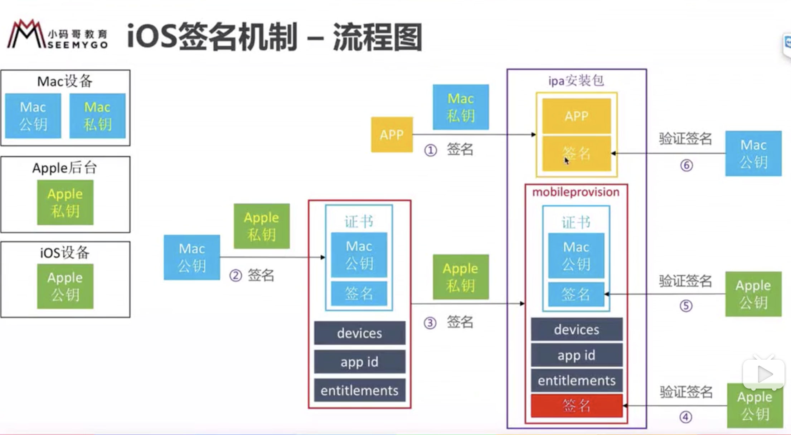

### 加密解密
#### 对称加密 
对称加密算法中，加密和解密用的是同一套密钥。
* DES
	DES是一种将64位明文加密成64位密文的对称加密算法，密钥长度是56位。
	由于DES每次只能加密64位的数据，遇到比较大的数据，需要DES加密进行迭代。
	目前已经可以在短时间内被破解，所以不建议使用。
* 3DES
	3DES就是将DES重复3次所得到的一种加密算法。过程就是通过3个密钥加解密，3个密钥都是不同的，加密过程：明文——加密——解密——加密——密文；解密过程：密文——解密——加密——解密——明文。
	3DES的处理速度不是很高，安全性也不是很高。
* **AES**
	AES是取代DES、3DES的首选对称加密算法。目前无法被破解。目前对称加密算法最主要就是使用AES。

##### 对称加密的密钥配送问题
对称加密，如果密钥好密文都被同一个人窃取，那么就可以被破解。
解决方案
* 事先共享密钥
* 密钥分配中心
	发送方将密钥发送给分配中心，接收方再从分配中心获取密钥
* Diffie-Hellman密钥交换
	OpenSSH中使用到了这个技术

#### 非对称加密
非对称加密中，加密和解密使用的是两种密钥。 
* 加密密钥，一般是公开的，所以也称**公钥**。 
* 解密密钥，由接收方保管，不能公开，称为**私钥**。
* 公钥和私钥是一一对应的，不能单独生成，称为密钥对。
##### 密钥配送问题
**非对称加密可以解决对称加密中的密钥配送问题**
* 由消息**接收者**，生成一对密钥 ：公钥+私钥。 (注意这里正好与数字签名相反)
* 接收者将公钥发送给消息发送者
* 发送者使用公钥加密
* 接收者使用私钥解密

##### RSA
**RSA**是目前使用最广泛的非对称加密算法。

#### 混合密码系统
* 对称加密特点
	* 加解密使用同一个密钥
	* 无法解决密钥配送问题
	* 加密速度快
*  非对称加密特点
	* 加解密使用不同密钥  
	* 加解密速度比较慢 
	* 不存在密钥配送问题

混合加密系统，是将对称加密和非对称加密优势相结合的方法。
* 利用了对称加密解决了加解密速度慢的问题
* 利用了非对称加密解决了密钥配送问题

HTTPS中所采用的SSL、TLS都是运用了混合加密系统。
混合加密过程（其实只需记到HTTPS的加解密过程就可以）：
Alice >>>>>>> Bob
1、Bob先生成一对公钥、私钥；
2、Bob把公钥共享给Alice；
3、Alice随机生成一个随机会话密钥；(临时密钥)；
4、Alice用随机会话密钥加密需要发送的消息; (对称加密)；
5、Alice使用Bob的公钥加密会话密钥。(非对称加密)；
6、Alice把4、5步的加密结果，一起发送给Bob；

解密过程：
1、Bob利用自己的私有密钥解密。(公钥加密，私钥解密)
2、Bob利用会话密钥解密发送。(对称加密)

### 单向散列函数
**单向散列函数，可以根据消息内容计算出固定长度的散列值**。散列值的长度和消息的长度无关，无论消息是1bt、10M、100G，单向散列函数都会计算出固定长度的散列值。
单向散列函数，也被称为**消息摘要函数，哈希函数**。
输出的散列值，也叫消息摘要、指纹。
eg:
```
用户口令 8bt ———— (单向散列函数 SHA-1 ) ———— 散列值20字节
图像数值 512bt ———— (单向散列函数 SHA-1 ) ———— 散列值20字节
存储文件 4GB ———— (单向散列函数 SHA-1 ) ———— 散列值20字节
硬盘文件 80GB ———— (单向散列函数 SHA-1 ) ———— 散列值20字节
```
特点：
* 根据任意长度的消息，计算固定长度的散列值；
* 计算速度快，能快速计算出散列值；
* 内容不同，散列值也不同，**防止数据被篡改**；
* 单向性，指计算出散列值后，无法推敲出原来的值；

常见的单向散列函数
* MD5
	产生128bit的散列值，目前已经不安全。
* SHA-1
	产生160bit的散列值，目前已经不安全。
* SHA-2
	这个是一个标准，它下面有SSHA-256、SHA-384、SHA-512。分别生成256bit、384bit、512bit的散列值，目前是比较安全的。

#### 应用
* 防止数据被篡改
	假设一份很重要的文件存储在电脑中，如果不加密，那么如果文件系统被黑客黑了，那文件内容就有可能被串改，而如果使用单向散列函数，每次查看的时候对比一下散列值，就可以知道文件是否有被篡改过。
* 口令密码的加密。
	比如密码，一般用单向散列函数做一下摘要，避免明文传输和明文存储。假如被中间人攻击了，或者数据库被攻破了，那账号密码就不容易被泄漏了。所以忘记了密码通常也无法找回，只能重新设置。

总结：
* **单向散列就是为了减少内容大小的**

### 数字签名
上文中的数据被篡改，是指原来有一份原始数据的情况下，再次查看数据时，经过前后对比散列值来判断数据是否被篡改。那如果始终没有接触过最原始的数据，怎么避免数据被篡改？
假设一个消息，被中间人攻击了，内容被篡改后再发送过来。那么接收数据的人如何判断消息被篡改了呢？

**数字签名就是可以解决消息真实性的问题。鉴别内容是否被串改！！**

数字签名步骤
* 用于加密和验证的私钥和公钥都是由发送者生成的。(非对称加密是由接受者生成的)
* 生成签名：
	由消息发送者完成，通过**签名密钥**生成
	* 如何保证这个签名是消息发送者自己签的？
		用消息发送者的私钥进行签名
* 验证签名：
	* 由消息接收者完成，通过**验证密钥**验证

在非对称加密过程中，所有发送者**获取**到 接收消息者 发出来的公钥，然后发送者再通过公钥加密好消息，发送给接收者，接收方用私钥进行解密读取消息。

数字签名消息的发送包含为**数字签名消息和非签名消息**。
数字签名消息中，消息发送者会事先发送一个公钥给消息接收者。然后发送者先使用自己手里的私钥对消息进行加密，然后将加密后的内容发送给接收者。接收方收到签名后，先用手里的公钥对签名进行解密，最终得到消息。
非签名消息中，消息直接发送给接收方。
将签名消息解密之后得到的最终消息与非签名消息进行比较，来确定最终数据的真实性。
不过如果消息内容非常大的话，这样两个消息的发送就会导致数据过大。所以数字签名消息中，可以先将原始消息做一下单向散列处理，然后再进行签名—发送的过程。最后的验证过程，也是将非签名消息做一下单向散列处理，最后对比数字签名消息解密后的结果来判断真实性。

总结：
* 非对称加密中，公私钥是消息接收者生成的。数字签名中，公私钥是消息发送者生成的。非对称加密中，发送者是被动获取公钥，数字签名中，发送者是主动发送公钥。 
* 数字签名的作用：确认消息的完整性、识别消息是否被串改、防止消息发送人否认(私钥加密)。
* **数字签名就是为了验证信息是否被篡改的**

#### 数字签名无法解决的问题
* 数字签名不能保证消息的机密性
  数字签名的作用不是为了保证消息机密性。而是为了鉴别元素消息是否有被篡改，而不是确保消息的机密性。

* **公钥的合法性没法保证**：
	数字签名必须保证接收者的公钥必须是真正属于发送者的。如果发生中间人攻击，公钥也可以被串改、伪造，导致数字签名失效。

* **中间人攻击**
  中间人攻击，就是中间人既承担了发送者的身份，也承担了接受者的身份。
具体步骤就是：
	* 发送者发送公钥给接收者的过程中，中间人拦截了公钥，将公钥替换成自己的公钥(伪公钥)发送给接收者，保留真实公钥；
	* 发送者发送未签名消息给接收者，中间人拦截了未签名消息，然后串改消息，再发送给接收者，接收者接收到的就是串改之后的消息；
	* 发送者发送已签名消息给接收者，中间人拦截了签名消息，用之前拦截的真实公钥解密，然后串改消息，使用自己的私钥（伪私钥）再进行加密发送给接收者；
	* 接收者接收到消息后，同样可以使用之前收的公钥（伪公钥）进行解密，解密出来的也是串改之后的消息。所以，这样消息真实性的验证就能够通过。中间人攻击就能奏效；

### 证书
证书的作用就是用于解决数字签名中，**公钥合法性无法保证**的问题。

所有的证书（驾驶证、身份证、公钥证书）都有一个统一的性质，那就是由权威机构认证颁发的。
密码学的证书是指**公钥证书**。它里面有姓名、邮箱等个人信息以及公钥，并由CA施加数字签名（数字签名过程，先将个人信息做单向散列，然后CA使用私钥对散列值进行加密，生成数字签名。）。

* 证书的使用和验证步骤
	* 接收者生成一对公钥和私钥；
	* 接收者将公钥提交到CA认证机构，进行注册；（这个提交也许是本地的，不太会存在中间人攻击问题）；
	* CA认证机构得到公钥后，会使用CA自己的私钥对那个公钥进行签名，然后生成一本证书；
	* **此时CA的数据库里就存在一个证书，该证书就包含接收者的公钥和CA的数字签名**；
	* 发送者要使用的时候，就去CA认证机构下载证书，首先进行一下证书的验证过程；
	* **认证过程**：发送者使用CA的公钥（这个是公开的）来解密证书里的数字签名，如果解密通过了，那说明证书是没有被串改的，表示认证通过了。这样也就相当于验证了证书里的公钥是没有问题的；
	* 发送者使用证书里的公钥对消息进行加密 ，然后发送给接收者；
	* 接收者使用私钥进行解密；

HTTPS的TLS证书也是这么个验证过程。

**总结**：
* 利用CA权威机构来解决中间人攻击的问题。
* **证书就是为了加密公钥的，保证公钥不会被篡改**

### iOS签名机制
用于保证安装到手机上的APP都是经过Apple允许的。 

#### 签名流程图
Mac设备有一对Mac公钥、Mac私钥；
Apple自己有一对Apple公钥、Apple私钥，只是Apple的私钥存储在Apple后台，Apple公钥存储在iOS设备中。

**iOS签名步骤**：


*  1、生成ipa安装包时，Xcode使用 Mac私钥 对APP源码文件进行签名。所以ipa安装包包含：APP源码文件、签名（编号001）；
*  2、生成证书时，使用Apple私钥对Mac公钥进行签名。所以证书包含：Mac公钥、签名（编号002）；
*  3、生成mobileprovision时，再次使用Apple私钥对(证书、devices、app id、entitlements)进行签名。所以mobileprovision文件包含：证书、devices、app id、entitlements、签名(编号003)；
*  4、最终打出来的包，就包含：ipa安装包和mobileprovision文件。
*  5、在安装的过程中，首先会使用Apple公钥验证最外一层的签名(编号003)，验证通过后，就说明mobileprovision里的内容（证书、devices、app id、entitlements）是没有被篡改的；
*  6、mobileprovision里的内容没有问题的话，再使用Apple公钥对证书里的签名（编号002）进行验证，验证通过后，说明证书里的内容（Mac公钥）是没有被篡改的；
*  7、证书里的内容没有问题的话，就可以直接使用Mac公钥了，然后使用Mac公钥验证ipa包里的签名（编号001），验证通过后，说明ipa包是没有问题的；
*  8、三层签名都验证完成后，那就可以把APP源码文件安装起来了。

其实从这一整套逻辑可以看出，它最终只是为了验证APP源码文件没有被篡改。
问题：
1、为什么不直接使用“Mac私钥签名，Mac公钥验证”这个步骤？
	不行，因为这样彻底脱离了Apple，而且这样就没法保证Mac公钥是合法的。所以生成证书的过程，也是为了验证Mac公钥是合法的。
2、为什么需要用Apple私钥进行第二次签名？
	第二次签名主要是添加了devices、APPID、entitlements。devices是为了控制只能用于调试的设备，APPID是为了控制只用于当前APPID的APP，entitlements则是为了控制当前APP所拥有的权限，比如推送、IAP等。
3、为什么不直接第一步就使用Apple私钥对APP进行签名，用Apple公钥进行验证？
	因为Apple私钥存在苹果服务器。这样的话，每一次运行都得先把APP传输到苹果服务器，效率就更低了。

签名步骤中，与我们实际操作的对应关系以及各文件的对应关系：
* 钥匙串访问——证书助理——从证书颁发机构请求证书：
	这里会获取到一个**CertificateSigningRequest.certSigningRequest**文件。这个文件就是**Mac公钥**；
* Apple官网 —— 添加Certificate证书——(选择develop证书或distribute证书)——提交CertificateSigningRequest.certSigningRequest文件：
	这里会生成一个.cer文件：distribute证书生成ios_distribution.cer证书，develop证书生成ios_development.cer文件。
	它就是利用Apple后台(可以认为是一个CA权威认证机构)的私钥对Mac公钥进行签名的过程。对应上诉步骤的第2步骤。
* Apple官网 —— 添加iOS Provisioning Profile文件——(选择development或App Store)——选择APP ID —— 选择deveces(development才会需要选择)——选择certificates—— 生成一个test .mobileprovision文件：
	这里就对应上诉第3步骤。

**总结**

* 生成 .certSigningRequest文件
  这个文件是Mac公钥，在本地电脑钥匙串获取的。

* 添加生成 .cer 文件
  这个熟称证书文件。是利用Apple私钥，对Mac公钥进行了数字签名

* 获取  .mobileprovision文件
    这个熟称配置文件。是利用Apple私钥，对[cer证书+deveces+AppID+entitlements]进行了数字签名


如果APP是从App Store下载安装的，就不需要  .mobileprovision文件，因为App Store已经保证了安装渠道是没有问题的。所以从App Store上下载的安装包，只使用了Apple私钥直接进行签名，然后安装时直接使用Apple公钥验证签名后就可以安装了。


